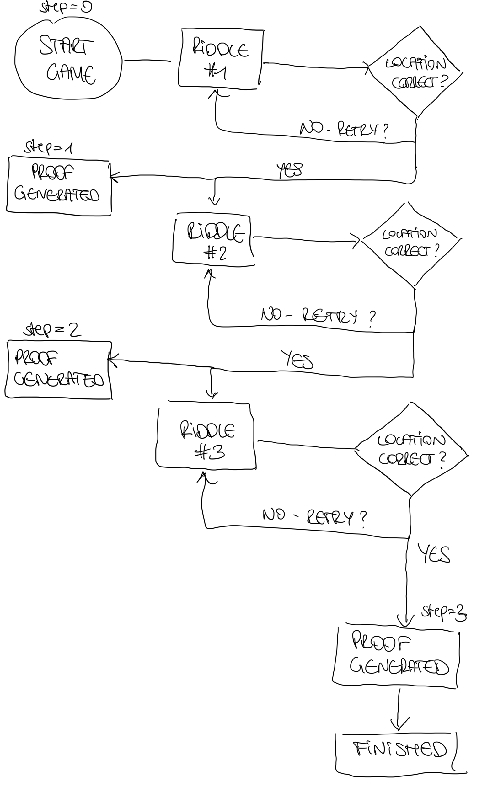

# Treasure Hunt ZkApp

## Project Overview
- players receive a puzzle which would lead them to a certain location
- players solve the puzzle by sharing the correct location
- finding all locations will unlock the ability to generate proof that you solved the treasure hunt without revealing the solution

## NOTES / OPEN QUESTIONS:

- [X] Which location metric is best to use? (long/lat or Geohash?)
    - to share long / lat me could multiply by 1000 (or whatever precision me would like) and add a O for t and 1 for 
        - PROBLEM: with precision we lose the exact location, so we need to check the range
    - geoHash can be nicely translated as an integer
        - HOWEVER: we would also need to check for neighboring geohashes to avoid edge cases → better solution
- [ ] Which precision should I use for the geoHash? How big is the range if I check neighboring geohashes? 
    - Depends on target, but for example sake let’s go for geoHash string of 7 characters 
        - E.g. if target is Stephansdom 
        - Precision of 9 chars: 48.20849, 16.373755, geoHash: u2edk854b
        - Precision of 7chars : 48.2087,16.3731, geoHash u2edk84
    - Algorithm to assert locations
        - Get all possible geohash integers within the given bounding box 
        - compare incoming geohash with all allowed geoHashes
        - [ ] which datastructure can I use to store all allowed geoHashes? 

- [X] How can I store the solution in secret? 
Store secret as commitment 
Inject secrets via github secrets 

## FOLLOWING ITERATIONS 
- [ ] Store valid location range in secret
- [X] App design/draw mockups 
- [ ] Create treasure hunt repo & MVP game with just 1 puzzle 
- [ ] Add more puzzles to the game as well as a timer
- [ ] Conduct test (phone/tablet/laptop)*
- [ ] User setup/login
- [ ] Leaderboard: pulling proofs from to present winners

## TIMELINE

| Deadline      | Description |
| ----------- | ----------- |
| 24/10      | 1) Finish MVP, pick UI design 2) User can pass location via UI 3) Location data is used to verify whether user is within valid range 4) Basic repo with UI setup       |
| 30/10   | 1) Store location in secret + treasure hunt MVP, 2) Valid location range is stored in secret such that it isn’t given away, 3) Create treasure hunt repo MVP: 1 puzzle to solve if user finds and shares the correct location, proof can be generated, state is updated & UI displays outcome (success/error), 4) Add documentation to the repo        |
| 6/11   | 1) Add more locations + user setup / login, 2) Add more puzzles to make the game more fun, 3) Solving one puzzle unlocks the next, 4) Solving all puzzles will generate a proof         |
| 13/11   | 1) Conduct tests, 2) Tested app on laptop/tablet/phone        |
| 18/11   | 1) Setup leaderboard page, 2) Previously generated proofs are displayed on the zkApp UI         |
| 24/11   | 1) Deploy and finalise stuff, 2) zkApp is deployed, 3) Documentation is updated, 4) Project is ready for showcasing        |
| 29/11   | Showcase        |
